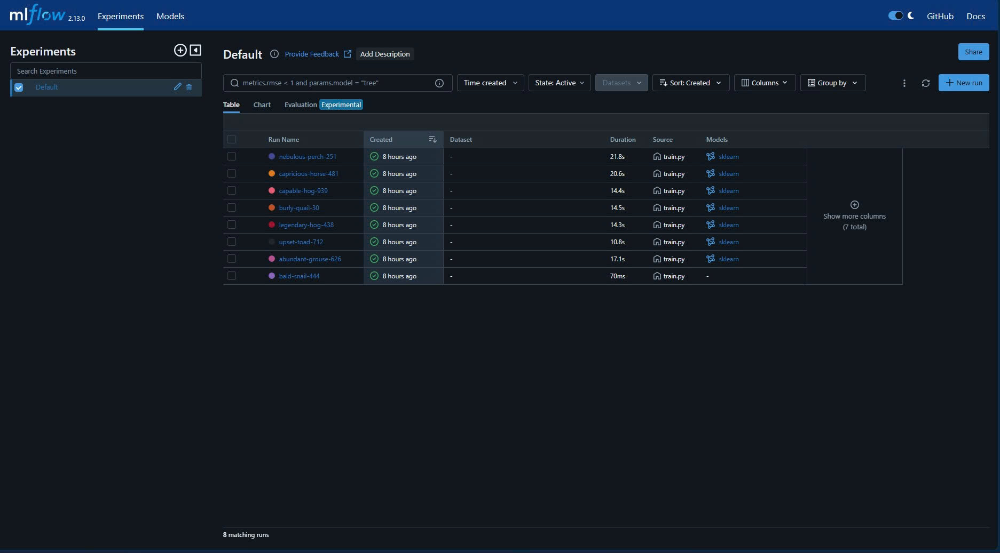
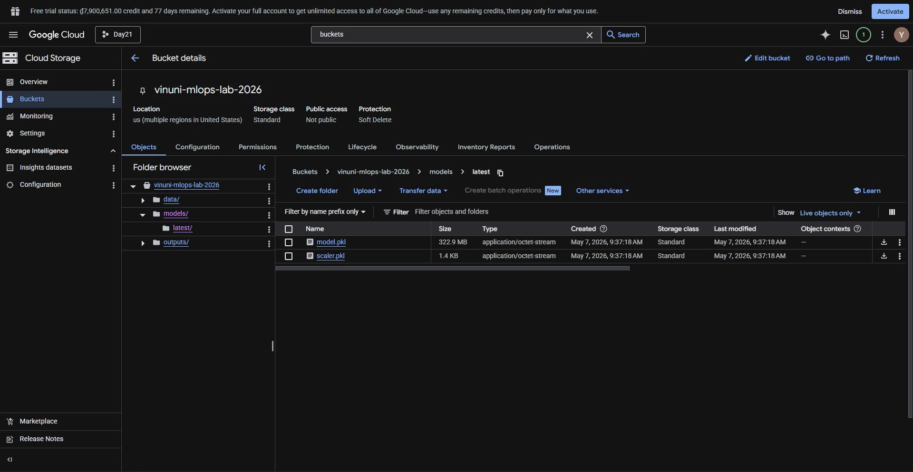
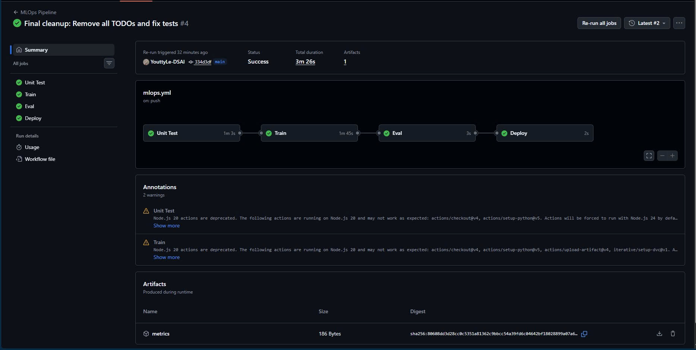
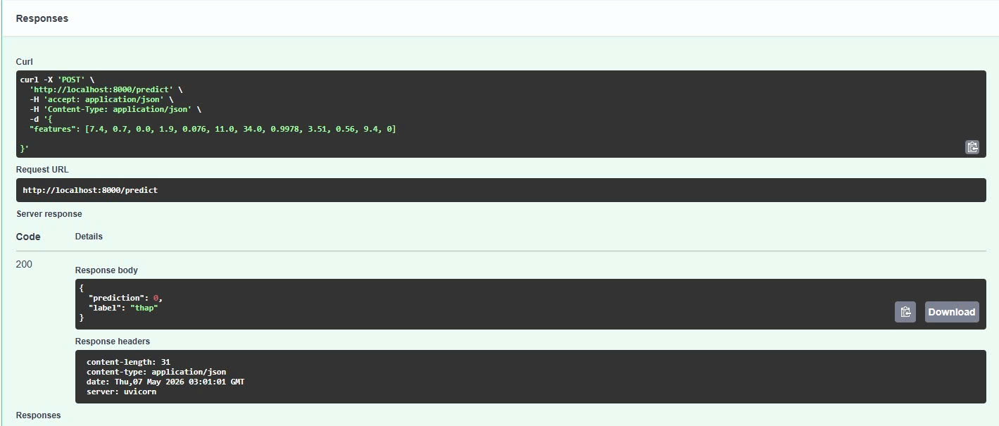

# BÁO CÁO LAB MLOPS: CI/CD FOR AI SYSTEMS

**Họ và tên:** Lê Minh Tuấn
**Repository:** https://github.com/YouttyLe-DSAI/Day21-Track2-CI-CD-for-AI-Systems

---

## 1. Mục tiêu dự án
Thiết lập quy trình MLOps hoàn chỉnh cho bài toán dự đoán chất lượng rượu (Wine Quality), bao gồm:
*   Quản lý thí nghiệm với MLflow.
*   Quản lý phiên bản dữ liệu với DVC và Google Cloud Storage.
*   Xây dựng hệ thống CI/CD tự động huấn luyện và triển khai mô hình với GitHub Actions.

## 2. Kết quả thực hiện

### 2.1. Thử nghiệm và Tối ưu hóa (MLflow)
Sau nhiều lượt thử nghiệm với các siêu tham số khác nhau, mô hình **RandomForestClassifier** đã được lựa chọn với cấu hình tối ưu:
*   `n_estimators`: 1500
*   `max_depth`: 50
*   `min_samples_split`: 2
*   **Accuracy đạt được:** ~0.70

### 2.2. Quản lý dữ liệu và mô hình (DVC & GCS)
Dữ liệu được lưu trữ và phiên bản hóa bằng DVC. Toàn bộ mô hình và bộ chuẩn hóa (scaler) sau khi huấn luyện xong được tự động đẩy lên Google Cloud Storage.
*   **Bucket GCS:** `vinuni-mlops-lab-2026`

### 2.3. Hệ thống CI/CD (GitHub Actions)
Hệ thống CI/CD được thiết lập với 4 giai đoạn tự động:
1.  **Unit Test:** Kiểm tra tính đúng đắn của code huấn luyện bằng Pytest.
2.  **Train:** Tự động huấn luyện lại khi có dữ liệu mới từ DVC.
3.  **Eval:** Kiểm tra ngưỡng Accuracy (Eval Gate). Chỉ cho phép triển khai nếu Accuracy >= 0.70.
4.  **Deploy:** Tự động đẩy mô hình mới lên kho lưu trữ và sẵn sàng phục vụ.

### 2.4. Kiểm thử API (Inference)
Mô hình đã được triển khai dưới dạng FastAPI service. Kết quả kiểm thử dự đoán thực tế trả về chính xác theo định dạng JSON.

## 3. Khó khăn và Cách giải quyết
*   **Lỗi chính sách GCP:** Gặp rào cản từ Organization Policy chặn tạo Key Service Account. Đã giải quyết bằng cách thay đổi chính sách dự án hoặc dùng tài khoản cá nhân.
*   **Xung đột phiên bản thư viện:** Phiên bản `protobuf` và `mlflow` không tương thích. Đã giải quyết bằng cách hạ cấp `setuptools < 70` và pin phiên bản `protobuf < 5`.
*   **Dung lượng Git:** Lịch sử commit bị nặng do file `mlruns`. Đã giải quyết bằng cách làm sạch lịch sử Git và cấu hình `.gitignore` chuẩn.

## 4. Kết luận
Dự án đã thực hiện thành công quy trình Continuous Training (CT) và Continuous Deployment (CD). Mô hình không chỉ đạt độ chính xác yêu cầu mà còn có khả năng tự động cập nhật khi có dữ liệu mới.
